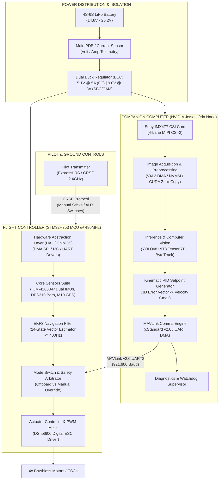
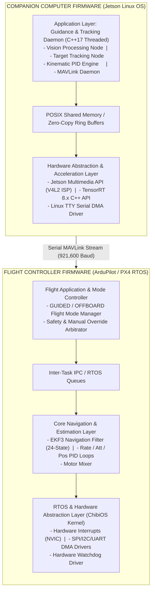

# Vision-Guided Autonomous Drone Companion System

PC vision lock for an **INAV/ArduPilot FPV drone**: camera tracks a target, then visual servoing steers **yaw + pitch** to keep it centered. The system is currently implemented as a Python-based PC prototype, with a detailed hardware and software specification targeting a production-grade Jetson Orin Nano + STM32 embedded system.

> **Safety:** Bench with **props off** first. This sends real RC channel values to the flight controller.

---

## 1. Current Prototype (PC / Python)

The current implementation is a PC-based prototype that communicates with the flight controller via MSP over USB/Serial.

### What it does

| Stage | Behavior |
|--------|----------|
| **Lock** | Mouse-drag ROI (`L`) or YOLO auto-lock (`Y`) |
| **Track** | CSRT between frames + YOLO refresh / reacquire |
| **Follow** | FPV visual servo → yaw & pitch sticks toward target center |
| **FC** | Continuous MSP AETR + ARM (CH5) + flight mode (CH6) |

### Hardware & INAV setup

| Item | Notes |
|------|--------|
| FPV / USB camera | Seen by Windows as a camera index |
| Flight controller | INAV with MSP on a UART |
| USB–serial link | e.g. FTDI / onboard USB VCP → `COMx` |
| Channel map | **AETR** (default in `main.py`) |

#### INAV Modes tab (typical)
| Mode | Channel | Range |
|------|---------|--------|
| **ARM** | CH5 / AUX1 | high ≈ 1800 |
| **ANGLE** | CH6 / AUX2 | high ≈ 1900 |

### Install

```bash
cd inercepterAI
python -m venv .venv

# Windows
.venv\Scripts\activate

pip install -r requirements.txt
```

*(Optional)* For CUDA (much faster YOLO):
```bash
pip uninstall -y torch torchvision
pip install torch torchvision --index-url https://download.pytorch.org/whl/cu124
```

### Run

#### Calibrate first (recommended, Props off!)
```bash
python calibration_fpv.py
```
1. Connect FC → set COM port → ANGLE ON.
2. Hold Yaw LEFT/RIGHT and Pitch UP/DOWN — craft should move that way.
3. Open camera → drag-lock a target.
4. Enable LIVE FOLLOW. If it turns the wrong way, flip Yaw / Pitch.
5. Save JSON → `calibration.json`.

#### Fly / Bench Follow
```bash
python main.py
```

### Controls

| Key | Action |
|-----|--------|
| **L** | Start lock selection (drag box) |
| **Y** | YOLO auto-lock |
| **E** / **D** | Enable / Disable follow assist |
| **A** / **X** | Arm (CH5) + Mode ON / Disarm + Mode OFF |
| **M** | Toggle flight mode CH6 |
| **0** | Force CH6 = 1900 |
| **Q** | Quit |

---

## 2. Onboard Radxa ZERO 3 (RK3566, 2GB RAM) Companion Setup

To run the tracking daemon on the **Radxa ZERO 3** (2GB RAM Linux SBC) connected to an INAV / Betaflight FC via MSP over UART2 (`/dev/ttyS2`):

### Installation & System Setup
```bash
# 1. Run automated Radxa setup (Installs OpenCV, V4L2, GStreamer, sets user permissions & performance governor)
chmod +x scripts/setup_radxa.sh
./scripts/setup_radxa.sh

# 2. Run system diagnostics
python3 scripts/diagnose_system.py
```

### Model Conversion (On PC)
On 2GB RAM Linux SBCs, PyTorch causes Out-Of-Memory (OOM) crashes. OpenCV DNN with ONNX models is used instead.
Convert your PyTorch `.pt` model to `.onnx` on your PC before copying to Radxa:
```bash
python scripts/export_to_onnx.py --weights models/drone_missile_best.pt
```

### Running Onboard
```bash
# Start tracking daemon manually
python3 main.py --config config.json

# Enable auto-start on boot via systemd
sudo cp interceptor.service /etc/systemd/system/
sudo systemctl daemon-reload
sudo systemctl enable interceptor
sudo systemctl start interceptor
```

---

## 2. Production-Grade Embedded System Architecture & Technical Specification

> [!NOTE]
> **Target Platform:** NVIDIA Jetson Orin Nano (8GB) + STM32H753 MCU  
> **Primary AI Core:** YOLOv8-Nano TensorRT INT8 (>60 FPS) | **Control Frequency:** 8 kHz Inner Loop / 400 Hz EKF3 / 50 Hz SBC Setpoint Stream

This section specifies the end-to-end embedded software and hardware architecture for the production version of the system. Designed as a high-performance, modular, and fail-safe hardware extension, this system mounts onto multirotor platforms to provide real-time target tracking, optical distance estimation, autonomous velocity setpoint generation, and immediate pilot override capability.

The system features a dual-processor heterogeneity model:
1. **Companion Computer (High-Level AI/Vision Core):** NVIDIA Jetson Orin Nano running real-time target detection (YOLOv8-Nano TensorRT INT8), visual object tracking (ByteTrack), monocular distance estimation, and kinematic PID vector computation.
2. **Flight Controller Core (Real-Time Safety/Control Core):** STM32H753 running ArduPilot/PX4 RTOS, handling sensor fusion (EKF3), attitude control loops, motor PWM output, manual RC receiver decoding, and hardware-level override arbitration.

> [!IMPORTANT]
> **Safety Guarantees**: Direct manual RC stick deflection (>10%) or heartbeat loss (>500 ms) automatically revokes autonomous authority, falling back to manual angle control or auto-hover.

### System Architecture Diagram



### System Workflow

1. **Image Capture:** 60 FPS MIPI CSI-2 Raw Bayer Stream directly into zero-copy memory.
2. **Target Inference:** INT8 Accelerated YOLOv8 TensorRT engine (< 10 ms execution).
3. **Distance Estimation:** Pin-hole camera model projection & optical expansion calculation.
4. **Kinematic PID Loop:** Translates visual displacement to 3D velocity setpoints at 50 Hz.
5. **MAVLink Serialization:** Encodes MAVLink Packets over UART.
6. **FC Command Ingestion:** Real-time decoding and validation on the STM32.
7. **Safety Arbitration:** Evaluates manual override vs autonomous mode (400 Hz Loop).
8. **Motor Execution:** Translates to DShot600 digital motor commands (8 kHz loop).

### Software Architecture



### Safety & Error Handling

- **Target Loss / Occlusion:** ByteTrack Kalman Filter predicts location based on velocity vector for 500ms before falling back to hover.
- **Process Freeze / Software Crash:** FC MAVLink Heartbeat timeout counter (> 500 ms) revokes autonomous control and reverts to Pilot Manual Angle Mode.
- **Telemetry UART Disconnect:** CRC-16 Checksum failures trigger drop of invalid frames; prolonged failures trigger manual fallback.

### Future Scalability

1. **Multi-Camera Stereo Vision Migration:** Dual MIPI CSI-2 interfaces allow for hardware binocular depth mapping.
2. **LiDAR / Time-of-Flight (ToF) Integration:** Augment optic distance tracking with millimeter-accurate altitude measurements.
3. **Model Context Protocol / AI Swarm Extension:** MAVLink setpoint pipeline supports swarm coordination.
4. **Over-The-Air (OTA) Firmware Updates:** Background firmware flashing via dual-bank Flash and Linux systemd frameworks.
