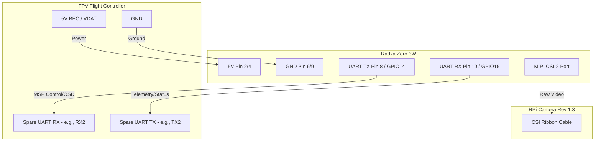

# T.R.I.V.E.N.I Hardware Wiring Guide (Radxa Zero 3W)

This document explains how to physically mount and wire the Radxa Zero 3W to an FPV drone's Flight Controller (FC) and the Raspberry Pi Camera.

## Circuit Diagram (Text Representation)

## Wiring Steps

### 1. Powering the Radxa
The Radxa Zero 3W requires a clean 5V power source. 
- **DO NOT** power the Radxa directly from the VTX pad if the VTX is already drawing heavy current.
- **DO** use a dedicated 5V BEC (Battery Eliminator Circuit) on the Flight Controller that supports at least 2A.
- Connect the FC's `5V` to Radxa Physical Pin 2 (or 4).
- Connect the FC's `GND` to Radxa Physical Pin 6 (or 9).

### 2. UART Serial Connection
The Radxa communicates with the Flight Controller using the MSP (MultiWii Serial Protocol). 
- Locate a **spare UART** on your Flight Controller (e.g., UART2).
- **Crossover the wires**: 
  - Connect Radxa's **TX** (Physical Pin 8 / `ttyS0`) to the FC's **RX2**.
  - Connect Radxa's **RX** (Physical Pin 10 / `ttyS0`) to the FC's **TX2**.
- *Note: Ensure you are using 3.3V logic levels. Most modern FCs use 3.3V UARTs, which matches the Radxa.*

### 3. Camera Connection
- Insert the Raspberry Pi Camera Rev 1.3 ribbon cable into the Radxa's MIPI CSI-2 port.
- The silver contacts on the ribbon cable should face the **heatsink/board**, away from the plastic locking tab.

## Physical Mounting Tips
- Use soft silicone standoffs to mount the Radxa to the drone frame to reduce high-frequency vibrations from the motors.
- The camera must be hard-mounted to the frame (no gimbals) for accurate kinematic tracking, but use TPU mounts to absorb "jello" vibrations.
