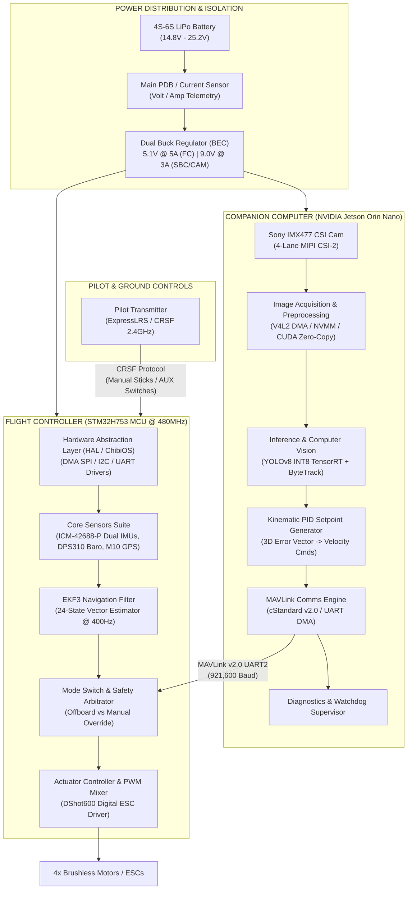
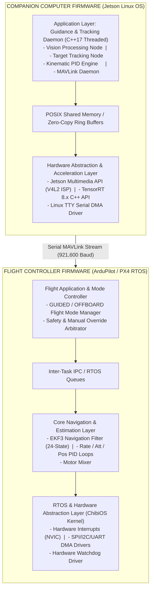
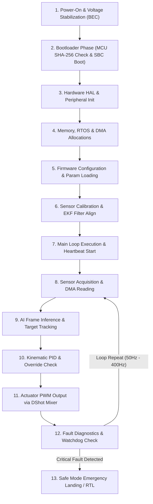
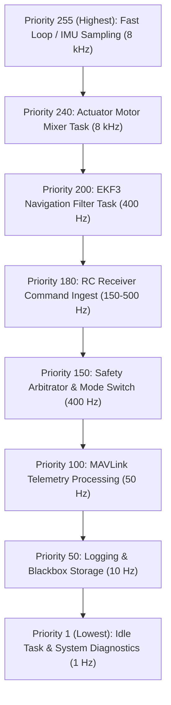
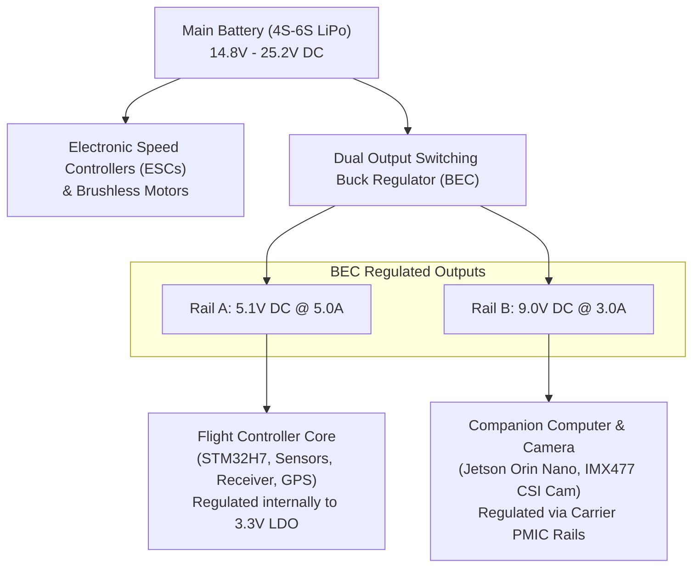
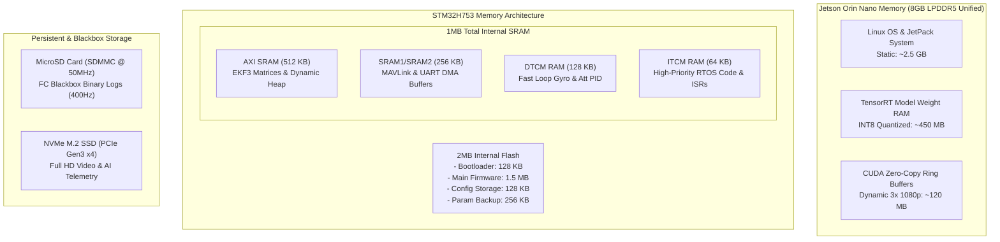

# Vision-Guided Autonomous Drone Companion System
## Production-Grade Embedded System Architecture & Technical Specification

> [!NOTE]
> **Document Version:** 1.1 | **Target Platform:** NVIDIA Jetson Orin Nano (8GB) + STM32H753 MCU  
> **Primary AI Core:** YOLOv8-Nano TensorRT INT8 (>60 FPS) | **Control Frequency:** 8 kHz Inner Loop / 400 Hz EKF3 / 50 Hz SBC Setpoint Stream

---

## Executive Summary & System Scope

This document specifies the end-to-end embedded software and hardware architecture for a **Vision-Guided Autonomous Drone Companion System**. Designed as a high-performance, modular, and fail-safe hardware extension, this system mounts onto multirotor platforms (FPV racing drones, enterprise quadcopters, industrial UAVs) to provide real-time target tracking, optical distance estimation, autonomous velocity setpoint generation, and immediate pilot override capability.

The system features a dual-processor heterogeneity model:
1. **Companion Computer (High-Level AI/Vision Core):** NVIDIA Jetson Orin Nano (ARM Cortex-A78AE + Ampere GPU) running real-time target detection (YOLOv8-Nano TensorRT INT8), visual object tracking (ByteTrack), monocular distance estimation, and kinematic PID vector computation.
2. **Flight Controller Core (Real-Time Safety/Control Core):** STM32H753 (Cortex-M7 @ 480 MHz) running ArduPilot/PX4 RTOS, handling sensor fusion (EKF3), attitude control loops, motor PWM output, manual RC receiver decoding, and hardware-level override arbitration.

> [!IMPORTANT]
> **Safety Guarantees**: Direct manual RC stick deflection (>10%) or heartbeat loss (>500 ms) automatically revokes autonomous authority, falling back to manual angle control or auto-hover.

---

## Table of Contents

1. [System Architecture Diagram](#1-system-architecture-diagram)
2. [System Workflow](#2-system-workflow)
3. [Hardware Components](#3-hardware-components)
4. [Software Architecture](#4-software-architecture)
5. [Communication Architecture](#5-communication-architecture)
6. [Complete System Flow](#6-complete-system-flow)
7. [Reliability & Robustness](#7-reliability--robustness)
8. [Real-Time Considerations](#8-real-time-considerations)
9. [Power Management](#9-power-management)
10. [Safety & Error Handling](#10-safety--error-handling)
11. [Memory Architecture](#11-memory-architecture)
12. [Future Scalability](#12-future-scalability)
13. [Design Decisions](#13-design-decisions)

---

## 1. System Architecture Diagram

Below is the hardware and software interaction architecture for the autonomous companion system.

---

## 2. System Workflow

| Stage | Purpose | Input | Output | Processing Performed | Dependencies | Timing | Error Handling | Recovery | Performance |
|---|---|---|---|---|---|---|---|---|---|
| **1. Image Capture** | Low-latency raw frame extraction | MIPI CSI-2 Raw Bayer Stream | NVMM Zero-Copy Frame Pointer | ISP Demosaicing, Noise Reduction, Hardware Color Format Conversion | Camera Sensor, ISP Driver | 60 FPS (16.6 ms cycle) | Frame Drop / Timeout (>33ms) | Restart V4L2 pipeline via DMA Reset | Zero-copy ISP memory, memory bandwidth < 10% |
| **2. Target Inference** | Detect target bounding box | RGB Frame Pointer (1080p -> 416x416) | Bounding Box $(x, y, w, h, \text{conf})$ | INT8 Accelerated Neural Net Inference via TensorRT engine | CUDA Cores, TensorRT runtime | < 10 ms execution | Low Confidence (<0.45) or Occlusion | Maintain target prediction via Kalman Filter | TensorRT INT8 quantization yields 100+ FPS |
| **3. Distance Estimation** | Calculate relative physical distance | Box Width/Height ($w, h$), Focal Length | Distance $D$ (meters) | Pin-hole camera model projection & optical expansion delta calculation | Calibrated Intrinsic Matrix | < 0.1 ms execution | Edge Clipping / Unrealistic $D$ Jump | Apply Exponential Moving Average & Outlier Rejection | CPU execution time negligible |
| **4. Kinematic PID Loop** | Translate visual displacement to 3D velocity | Box Error $(e_x, e_y)$, Distance Error $e_d$ | Target Velocities $(V_x, V_y, V_z, r)$ | Triple PID loop computation, derivative filtering, velocity clamping | Target state estimator | 50 Hz (20 ms cycle) | Integral Windup / NaN setpoint | Clamp integral terms, fall back to hover velocity $(0,0,0)$ | Deterministic C++ execution < 0.2 ms |
| **5. MAVLink Serialization** | Transmit target velocity commands to FC | Velocities $(V_x, V_y, V_z, r)$ | Encoded MAVLink Packets | Packet construction, CRC-16 computation, UART DMA ring buffer enqueue | UART Hardware Driver | 50 Hz stream | UART Transmission Error / TX Buffer Full | Flush DMA TX buffer and retry next cycle | Minimal CPU overhead via DMA hardware |
| **6. FC Command Ingestion** | Verify setpoint authenticity & state validation | Serial MAVLink Stream | Validated Command Structure | MAVLink frame decoding, CRC validation, Offboard mode safety check | UART Interrupt, MAVLink Decoder | < 1 ms latency | CRC Failure / Packet Corruption | Drop packet, use last valid command with 200ms decay | Processing within serial ISR context |
| **7. Safety Arbitration** | Evaluate manual override vs autonomous mode | RC Channel Inputs, MAVLink Command | Active Control Setpoint | Stick threshold comparison ($>10\%$), AUX switch position check, Heartbeat timeout check | RC Receiver, Timer Interrupts | 400 Hz Loop | SBC Heartbeat Loss (>500ms) or RC Signal Loss | Fall back to Altitude Hold/Loiter or RTL | Zero latency switch execution |
| **8. Motor Execution** | Translate control setpoint to motor signals | Pitch, Roll, Yaw, Thrust setpoints | DShot600 Digital Motor Commands | PID Attitude loop, Motor Mixing, Electronic Speed Controller output | DShot Driver, Timer Peripheral | 8 kHz / DShot600 | ESC Telemetry Error / Frame Sync loss | Fallback to analog PWM / Lock motor state safely | Hardware timer interrupt driven |

---

## 3. Hardware Components

### 1. Primary Processor (Companion Computer)
* **Component Name:** NVIDIA Jetson Orin Nano (8GB)
* **Function:** High-level AI inference, visual tracking, distance estimation, MAVLink setpoint execution.
* **Why Required:** Runs neural network models at >60 FPS under 10W-15W power constraints without taxing flight control hardware.
* **Inputs:** 4-Lane MIPI CSI-2, UART (Telemetry), 9V-19V DC Power Input.
* **Outputs:** UART MAVLink velocity commands, Debug USB-C, Status LED GPIOs.
* **Interfaces Used:** MIPI CSI-2, UART2 (`/dev/ttyTHS1`), SPI, I2C, NVMe PCIe Gen3 x4.
* **Power Considerations:** Peak power consumption 15W at maximum GPU clock; requires dedicated step-down BEC module with clean output ripple (<50mV).
* **Communication Protocol:** UART MAVLink v2.0 at 921,600 baud.
* **Failure Scenarios:** Thermal throttling, brownout due to power rail dip, kernel panic, CSI pipeline freeze.

### 2. Real-Time Flight Controller (FC MCU)
* **Component Name:** STM32H753BIT6 High-Performance Microcontroller (ARM Cortex-M7 @ 480 MHz, 2MB Flash, 1MB RAM).
* **Function:** Real-time attitude estimation, sensor fusion (EKF3), motor mixer control, safety override arbitration.
* **Why Required:** Low-level real-time control requires deterministic, sub-millisecond control loops that a general Linux OS cannot guarantee.
* **Inputs:** Dual IMUs, Barometer, Magnetometer, GPS, RC Receiver (CRSF/SBUS), MAVLink UART.
* **Outputs:** 4x DShot600 ESC lines, Telemetry UART, Buzzer/LED outputs.
* **Interfaces Used:** SPI (IMUs/Flash), I2C (Baro/Mag), USART (RC/Telemetry), SDMMC (Blackbox).
* **Power Considerations:** 5.1V clean input from BEC; draws ~350mA. Integrated Power Management Unit (PMU) handles voltage regulation.
* **Communication Protocol:** Internal SPI/I2C, External CRSF/MAVLink.
* **Failure Scenarios:** Single IMU failure (handled by redundant IMU switching), HardFault exception (handled by Watchdog reset and safe mode landing).

### 3. Primary Optical Sensor
* **Component Name:** Sony IMX477 12.3MP Sensor with Wide-Angle Global/Rolling Shutter Lens.
* **Function:** Captures high-frame-rate video for object detection and visual tracking.
* **Why Required:** Low noise, high sensitivity, and MIPI CSI-2 interface enable high-speed frame transfers directly into Jetson zero-copy memory.
* **Inputs:** Photonic scene spectrum, Control I2C from SBC.
* **Outputs:** 4-Lane MIPI CSI-2 Raw Bayer stream (1080p @ 60 FPS / 720p @ 120 FPS).
* **Interfaces Used:** MIPI CSI-2, I2C (Camera Control).
* **Power Considerations:** 3.3V / 1.8V supplied via SBC carrier board interface (<1.5W).
* **Communication Protocol:** MIPI CSI-2 D-PHY v1.2, I2C CCI.
* **Failure Scenarios:** Lens occlusion, MIPI frame sync loss, ribbon cable mechanical disconnection.

### 4. Inertial Measurement Unit (IMU) Cluster
* **Component Name:** Dual InvenSense ICM-42688-P (6-Axis Gyro + Accelerometer).
* **Function:** Measures angular velocity and linear acceleration for EKF3 state estimation.
* **Why Required:** Redundant high-frequency low-noise IMUs prevent sensor degradation due to high drone motor vibration.
* **Inputs:** Physical motion forces (Angular rate, Acceleration).
* **Outputs:** SPI digital register readings.
* **Interfaces Used:** SPI @ 24 MHz (Dedicated SPI Bus per IMU).
* **Power Considerations:** 3.3V ultra-low-noise LDO regulated line (<20mA).
* **Communication Protocol:** SPI Mode 0/3.
* **Failure Scenarios:** Accelerometer saturation, sensor bus locks (handled by dynamic SPI bus reset and failover to secondary IMU).

### 5. RC Receiver Module
* **Component Name:** TBS Crossfire Nano RX / ExpressLRS 2.4GHz Receiver.
* **Function:** Receives pilot control stick inputs and switch positions from ground transmitter.
* **Why Required:** Enables manual control pass-through and immediate hardware override of autonomous modes.
* **Inputs:** 2.4GHz / 868MHz RF Link.
* **Outputs:** CRSF Serial protocol stream.
* **Interfaces Used:** USART (Inverted/Non-inverted full duplex).
* **Power Considerations:** 5V powered from FC; draws <100mA.
* **Communication Protocol:** CRSF (420k baud, low latency).
* **Failure Scenarios:** Radio signal loss (failsafe triggers auto-RTL or hover), line disconnect.

---

## 4. Software Architecture

### Module Breakdown

#### 1. Vision Processing Node (`vision_node`)
* **Responsibility:** Ingest raw MIPI CSI-2 frames, apply hardware ISP color conversion, execute TensorRT INT8 object detection, and pass bounding boxes to tracker.
* **Inputs:** NVMM DMA Frame Buffer pointers.
* **Outputs:** Structured Bounding Box array `[x, y, width, height, confidence, class_id]`.
* **Internal Workflow:** Async frame capture via V4L2 -> CUDA memory pointer mapping -> TensorRT engine enqueue -> NMS non-maximum suppression execution.
* **Dependencies:** CUDA 12.x, TensorRT 8.6+, V4L2 API.
* **Error Handling:** If CUDA kernel returns an execution error or frame capture drops out, the node resets the camera pipeline and outputs a blank detection flag.
* **Memory Usage:** 120MB GPU Unified RAM; zero CPU memory duplication.
* **Performance Considerations:** High priority thread scheduled on CPU Core 1 (Isolated core); execution time <10ms per frame.

#### 2. Target Tracking & Distance Node (`tracker_node`)
* **Responsibility:** Associate bounding boxes over time using ByteTrack algorithm; compute monocular distance using optical scaling metrics.
* **Inputs:** Raw detection bounding boxes.
* **Outputs:** Filtered Target State Vector `[X_center, Y_center, Estimated_Distance, Velocity_Target_X, Velocity_Target_Y]`.
* **Internal Workflow:** Predict state using Kalman filter -> Calculate IoU matrix with incoming detections -> Hungarian Matching algorithm -> Calculate pin-hole distance metric.
* **Dependencies:** Eigen C++ matrix library.
* **Error Handling:** If object is lost (occlusion), the tracker maintains state prediction for 500ms before declaring loss of target lock.
* **Memory Usage:** Static memory allocation (<2MB RAM).
* **Performance Considerations:** Execution time <1 ms per frame.

#### 3. Kinematic Setpoint Generator (`setpoint_node`)
* **Responsibility:** Calculate spatial error between image optical center and target coordinates; compute 3D body velocity commands via PID controllers.
* **Inputs:** Filtered Target State Vector, Current Drone State from Flight Controller.
* **Outputs:** Setpoint Velocities $(V_x, V_y, V_z, Yaw\_Rate)$.
* **Internal Workflow:** Calculate error -> Pass through Proportional-Integral-Derivative filters -> Apply velocity limiters and S-curve acceleration constraints -> Package output.
* **Dependencies:** C++ Math Library.
* **Error Handling:** Clamps setpoints to max safe operational velocity (e.g., $5.0 \text{ m/s}$ forward, $2.0 \text{ m/s}$ vertical). Integrators reset if error changes sign.
* **Memory Usage:** Static stack allocation.
* **Performance Considerations:** Runs deterministically at 50Hz.

#### 4. Flight Controller Safety & Mode Arbitrator (`fc_safety_arbitrator`)
* **Responsibility:** Intercept commands from the companion computer; cross-check with RC receiver switch states and stick deflection; route final control authority to attitude controller.
* **Inputs:** MAVLink `SET_POSITION_TARGET_LOCAL_NED` commands, CRSF RC channels, Heartbeat timers.
* **Outputs:** Active control input matrix passed to EKF/Attitude PID loops.
* **Internal Workflow:** Check RC AUX Switch position -> If `OFFBOARD`, evaluate pilot stick position -> If stick deflection $< 10\%$ AND SBC Heartbeat active ($<500\text{ms}$ old), pass autonomous setpoint; ELSE route RC stick commands directly.
* **Dependencies:** FC Firmware RTOS Kernel (ArduPilot/PX4).
* **Error Handling:** Immediate fail-over to manual angle mode or loiter if heartbeat is lost or stick override threshold is breached.
* **Memory Usage:** Low footprint (<4KB RAM).
* **Performance Considerations:** Executes at maximum RTOS task priority (400Hz).

---

## 5. Communication Architecture

### Protocol 1: MAVLink v2.0 (SBC <-> Flight Controller)
* **Purpose:** High-level telemetry exchange, mode status, offboard velocity setpoint commands, system status heartbeat.
* **Data Transmitted:** `HEARTBEAT`, `SET_POSITION_TARGET_LOCAL_NED`, `ATTITUDE_QUATERNION`, `SYS_STATUS`.
* **Frequency:** Setpoint commands at 50 Hz; Heartbeat at 1 Hz; Telemetry output at 20 Hz.
* **Reliability Strategy:** Hardware-level CTS/RTS flow control enabled on UART; DMA double-buffering.
* **Error Detection:** MAVLink v2.0 frame CRC-16-MCRF4XX checksum calculation per packet; sequence counter validation to detect frame drops.
* **Recovery Mechanism:** Corrupt packets are dropped immediately. If valid setpoints are missing for $>200\text{ms}$, FC decays velocity commands linearly to zero. If missing for $>500\text{ms}$, FC executes autonomous hold/loiter.
* **Why Selected:** Standardized across drone hardware, highly efficient binary overhead, native integration with ArduPilot/PX4 navigation pipelines.

### Protocol 2: MIPI CSI-2 (Camera Sensor -> SBC)
* **Purpose:** Direct image sensor raw data stream transmission to GPU memory.
* **Data Transmitted:** 1080p @ 60 FPS Raw Bayer pixels.
* **Frequency:** Continuous 60 Hz frame clock.
* **Reliability Strategy:** Differential high-speed signaling across multi-lane PCB traces with matched impedance ($100\,\Omega$).
* **Error Detection:** Hardware CRC generation per CSI packet at receiver PHY layer.
* **Recovery Mechanism:** V4L2 subsystem re-initializes MIPI receiver DMA ring buffers upon 3 consecutive frame timeout interrupts.
* **Why Selected:** Ultra-low latency transmission (<2ms) without memory copy overhead, bypassing USB controller hardware bottlenecks.

### Protocol 3: CRSF Protocol (RC Receiver -> Flight Controller)
* **Purpose:** Low-latency transmission of manual pilot commands and switch states.
* **Data Transmitted:** 16 Analog control channels, telemetry status back-link.
* **Frequency:** 150 Hz / 500 Hz update rates.
* **Reliability Strategy:** Hardware UART with DMA interrupt on idle line.
* **Error Detection:** 8-bit CRC polynomial check on each packet frame.
* **Recovery Mechanism:** Transmitter/Receiver link loss triggers hardware receiver failsafe flag, overriding FC mode to auto Return-To-Launch (RTL).
* **Why Selected:** Industry standard for ultra-low latency (<4ms) manual flight control.

---

## 6. Complete System Flow

### Execution Lifecycle Workflow Diagram

### Detailed Sequence Explanation

1. **Power On:** Primary Lipo connected ($14.8\text{V}-25.2\text{V}$). Step-down BEC modules stabilize $5.1\text{V}$ and $9.0\text{V}$ power rails within $50\text{ms}$. Power-On-Reset (POR) circuits release MCU/SBC reset pins.
2. **Bootloader Execution:** STM32H7 executes secondary bootloader from flash memory, verifies firmware integrity via SHA-256 hash check, and jumps to main firmware address. Simultaneously, Jetson Orin Nano executes CBoot/U-Boot and initializes Linux kernel.
3. **Hardware Initialization:** FC initializes clock trees (480 MHz Core, 240 MHz Peripheral), interrupt controllers (NVIC), and internal SRAM blocks.
4. **Peripheral Initialization:** FC configures DMA streams for SPI1, SPI2 (IMUs), I2C1 (Sensors), USART2 (Companion Telemetry), and TIM1/TIM2 (DShot outputs).
5. **Configuration Loading:** Calibration parameters, PID terms, safety thresholds, and baud rates are read from EEPROM/FRAM into system active memory.
6. **Sensor Initialization & EKF Alignment:** Gyroscopes, accelerometers, magnetometers, and barometer are initialized. Dual IMU data feeds into EKF3 filter; system waits $3-5\text{ seconds}$ for orientation/velocity variance convergence.
7. **Main Control Loop Start:** FC launches RTOS scheduler; companion computer executes C++ system tracking service daemon (`drone_vision_daemon`). MAVLink bidirectional heartbeats commence.
8. **Event Processing & Sensor Reading:** Gyro/Accel samples acquired via high-speed SPI DMA interrupts at 8 kHz; CSI camera frames streamed to SBC GPU memory via V4L2 zero-copy interface at 60 Hz.
9. **Communication & Vision Processing:** SBC detects target bounding boxes using TensorRT INT8 model, tracks target across frame buffers via ByteTrack, and derives target spatial coordinates.
10. **Data Processing & Kinematic Calculation:** Spatial error terms pass through SBC PID position regulators to generate 3D velocity vectors, serialized as MAVLink setpoint packets sent to FC over UART.
11. **Safety Override & Output Control:** FC Safety Arbitrator checks pilot transmitter AUX switch state and manual stick displacements. If in `OFFBOARD` mode and sticks are neutral ($<10\%$), SBC velocity vectors are injected into EKF kinematic controllers. Mixer outputs calculated motor commands via DShot600 protocol at 8 kHz.
12. **Diagnostics & Error Detection:** Hardware watchdog timers on MCU ($100\text{ms}$) and software watchdog timers on SBC ($500\text{ms}$) are periodically petted. Voltage levels, CPU thermal metrics, and loop execution latencies are continually validated.
13. **Safe Shutdown / Safe State Mode:** Upon critical system fault (low battery voltage $<3.3\text{V/cell}$, sensor failure, loss of manual link, or SBC software freeze), system drops autonomous control and transitions to safe RTL (Return-To-Launch) mode or lands immediately.

---

## 7. Reliability & Robustness

### Stable Operation & Hardware Watchdog Architecture
* **Hardware Watchdog Timer (WDG):** The STM32H7 uses an Independent Watchdog (IWDG) driven by a dedicated internal low-speed RC oscillator (LSI @ $32\text{ kHz}$). If the main firmware loop hangs for $>100\text{ ms}$ without refreshing the watchdog register, a system reset is triggered.
* **Companion Computer Software Watchdog:** A system daemon monitors the tracking process (`drone_vision_daemon`). If the tracking process crashes or freezes, systemd automatically restarts the service within $200\text{ ms}$.

> [!CAUTION]
> **Power Transient Protection**: High-current motor bursts can cause transient voltage drops. Large low-ESR capacitors ($470\,\mu\text{F}$) combined with ceramic decoupling capacitors ($0.1\,\mu\text{F}$) must be present on each IC supply line.

### Brownout & Power Transient Protection
* **Brownout Reset (BOR):** MCU internal Brownout Reset circuitry continuously monitors the $V_{DD}$ supply rail. If supply voltage drops below $2.7\text{ V}$, the processor is cleanly held in reset to prevent random code execution and flash memory corruption.
* **Power Supply Decoupling:** Large low-ESR electrolytic capacitors ($470\,\mu\text{F}$) combined with ceramic decoupling capacitors ($0.1\,\mu\text{F}$) on each IC supply pin suppress voltage dips caused by sudden ESC motor current spikes.

### Sensor Failure & Fault Isolation
* **Dual Redundant IMUs:** Two separate physical IMU chips (ICM-42688-P) are sampled simultaneously on separate SPI buses. The EKF3 algorithm monitors innovation residuals between IMU signals. If one IMU exhibits noise spikes or sensor freezes, the system flags the bad sensor and seamlessly switches full navigation authority to the healthy IMU without attitude loss.

---

## 8. Real-Time Considerations

### Task Priorities & RTOS Scheduling (ArduPilot / ChibiOS)

### Interrupt Priorities & Latency Management
* **Nested Vectored Interrupt Controller (NVIC):** Hardware interrupts are strictly prioritized:
  * **Priority 0 (Highest):** SPI IMU Data Ready GPIO Interrupts.
  * **Priority 1:** DShot Timer Outputs & Motor DMA interrupts.
  * **Priority 2:** UART DMA Receiver Idle Interrupts (CRSF / MAVLink).
  * **Priority 3:** System Tick Timer (1000 Hz).
* **Deterministic Execution:** No blocking operations inside Interrupt Service Routines (ISRs). ISRs merely set flags, pull DMA pointers, and wake higher-priority RTOS worker threads using counting semaphores.

---

## 9. Power Management

### Power Mode States
1. **Full Operational Flight Mode:**
   * SBC running in 15W MAX-N Mode (All CPU cores & CUDA clusters active).
   * FC fully active @ 480 MHz.
   * CSI camera sensor active @ 60 FPS.
2. **Ground Power Conservation Mode (Pre-Arming):**
   * SBC throttles automatically to 7W operational mode until arming sequence command is detected over MAVLink.
   * Frame rate throttled to 15 FPS to prevent thermal build-up without propeller airflow.
3. **Emergency Power Savings Mode:**
   * Triggered upon Critical Battery Level ($<3.3\text{V/cell}$).
   * Companion computer GPU/NPU pipeline is powered down completely to preserve electrical power for manual pilot flight controls and motor operation.

---

## 10. Safety & Error Handling

| Module | Failure Mode | Detection Mechanism | Primary Mitigation | Safe State Recovery |
|---|---|---|---|---|
| **Vision Model** | Target Loss / Occlusion | Bounding box confidence drops below threshold ($<0.45$) for 3 frames | ByteTrack Kalman Filter predicts location based on velocity vector | Maintain last velocity setpoint for 500ms; if target is not found, command drone to zero-velocity hover |
| **SBC Application** | Process Freeze / Software Crash | FC MAVLink Heartbeat timeout counter exceeds $500\text{ ms}$ | FC safety arbitrator immediately revokes Offboard mode control authority | System reverts to Pilot Manual Angle Mode or Auto-Loiter |
| **Telemetry UART** | Serial Line Disconnect / Noise | CRC-16 Checksum failure rate exceeds $30\%$ over 100ms window | FC drops invalid frames and halts velocity command ingestion | Vehicle enters autonomous zero-velocity brake mode and drops back to Manual RC Mode |
| **Power Distribution** | Voltage Dip below threshold ($<12.0\text{V}$) | FC Power Module ADC reads low main rail voltage | Trigger audible buzzer warning and send low-battery telemetry flag | Disables autonomous mode execution; forces Pilot manual override for immediate landing |
| **Optical Camera** | CSI Bus Freeze / Disconnection | V4L2 kernel driver reports frame timeout ($>33\text{ms}$) | SBC executes hardware CSI bus reset and attempts driver re-bind | Vehicle drops autonomous velocity setpoints to zero and notifies FC of vision loss |

> [!WARNING]
> **Loss of Heartbeat**: If valid velocity commands or MAVLink heartbeats are missed for $>500\text{ ms}$, the FC arbitrator forces an automatic mode change to Loiter/Hover.

---

## 11. Memory Architecture

### Flight Controller Memory Map Breakdown

| Memory Segment | Size | Purpose / Assigned Subsystem | Access Speed |
|---|---|---|---|
| **Flash (Bank 1 & 2)** | 2 MB | Bootloader (128KB), Main Executable (1.5MB), EEPROM Parameters (128KB) | Read-Only Fast Access |
| **AXI SRAM** | 512 KB | EKF3 Navigation 24-State Matrices, Dynamic Heap Allocation | 240 MHz System Bus |
| **SRAM1 / SRAM2** | 256 KB | MAVLink Packet Buffers, UART/SPI DMA Ring Buffers | 240 MHz AHB Bus |
| **DTCM RAM** | 128 KB | Fast Gyro Loop Variables, Attitude PID States (Zero-Wait State) | 480 MHz Core Clock (Tightly Coupled) |
| **ITCM RAM** | 64 KB | Time-Critical ISR Vectors and Fast PID Core Functions | 480 MHz Core Clock (Tightly Coupled) |

---

## 12. Future Scalability

1. **Multi-Camera Stereo Vision Migration:** The architecture is designed with dual MIPI CSI-2 hardware interfaces on the Jetson Orin Nano. A second camera module can be attached to provide native hardware binocular depth mapping without requiring monocular pin-hole estimation assumptions.
2. **LiDAR / Time-of-Flight (ToF) Integration:** Lightweight micro-LiDAR sensors (e.g., LightWare SF11/C) can be interfaced to the FC via I2C/UART to augment optic distance tracking with millimeter-accurate ground altitude and obstacle measurements.
3. **Model Context Protocol / AI Swarm Extension:** The software architecture is wrapped inside clean POSIX C++ abstractions. The MAVLink setpoint pipeline supports extension to multi-drone swarm coordination protocols, allowing multiple companion units to share target spatial vectors via a mesh Wi-Fi/ExpressLRS network.
4. **Over-The-Air (OTA) Firmware Updates:** The dual-bank Flash structure of the STM32H7 combined with Linux systemd OTA deployment frameworks allows background firmware flashing over a high-speed wireless link while the system is grounded.

---

## 13. Design Decisions

| Decision | Reason Chosen | Benefits | Trade-offs | Future Improvements |
|---|---|---|---|---|
| **Dual Processor (MCU + SBC) Architecture** | Decouples strict real-time motor control loops from non-deterministic neural network inference loops | Guarantees continuous sub-millisecond flight stability even if the high-level AI operating system freezes or crashes | Increases overall system weight, wiring complexity, and power draw | Migration to single SoC containing both Real-Time Cortex-R cores and GPU hardware acceleration |
| **TensorRT INT8 Quantization Engine** | Optimizes execution speed of YOLO detection networks on embedded GPU architecture | Achieves >60 FPS inference speed with minimal accuracy degradation (<1% mAP drop) | Requires offline calibration dataset generation during initial model training | Dynamic INT8 calibration pipelines running directly on recorded flight logs |
| **Hardware RC Stick Override (Arbitrator)** | Provides physical safety guarantee to pilot during flight testing | Enables pilot to regain full control instantly by flicking RC sticks without needing to find a mode switch | Requires careful calibration of deadband thresholds to prevent accidental disengagement during soft autonomous manoeuvres | Adjustable stick threshold sensitivities mapped dynamically to drone speed |
| **MIPI CSI-2 Direct Sensor Interface** | Bypasses USB host controller stack and CPU hardware bottlenecks | Provides direct zero-copy DMA transfer of raw camera frames into GPU memory with sub-2ms latency | Ribbon cables are susceptible to high-frequency RF interference from drone video transmitters | Custom shielded coaxial MIPI cable assemblies with locking connectors |
| **DShot600 Motor Protocol** | Enables digital communication between FC and ESCs | Provides high update speeds (600 kbit/s), built-in CRC error checking, and removes manual analog throttle calibration | Requires precise hardware timer outputs on MCU | Transition to DShot1200 or Bidirectional DShot to receive real-time motor RPM feedback |